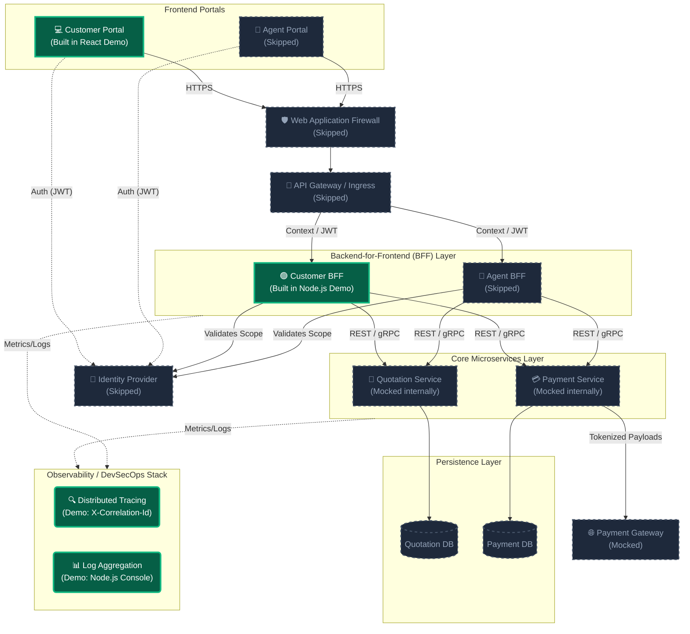
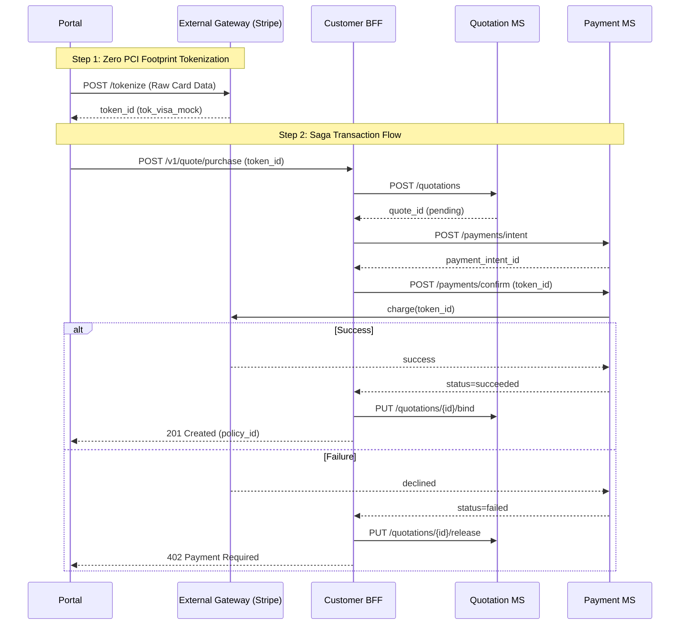

# Backend-For-Frontend (BFF) Solution Design

## 1. Executive Summary

This document outlines the architectural design for a multi-service platform supporting **Quotation** and **Payment** capabilities. To address the unique user experiences of the **Customer Portal** and the **Agent Portal**, we propose a **Backend-For-Frontend (BFF)** pattern.

This design emphasizes high scalability, resilient transaction handling, comprehensive observability, and strict security compliance, specifically concerning Personally Identifiable Information (PII) and Payment Card Industry (PCI) standards.

---

## 1.1 Design Philosophy: Security & Resiliency Thinking

The architecture detailed in this document is guided by a "Secure by Design" philosophy. We prioritize regulatory compliance and platform uptime above all else:

- **PCI-DSS Compliance (The Business Decision)**: We consciously choose a "Zero PCI Footprint" strategy. By utilizing frontend tokenization, we ensure raw card data is handled exclusively by the Payment Gateway. This reduces our relative compliance burden from over 300 audit controls (SAQ-D) down to roughly 20 (SAQ-A), mitigating massive organizational risk.
- **Fail-Safe Idempotency (The User Experience Decision)**: We treat every mutation request as potentially duplicated. By enforcing mandatory Idempotency keys from the portal layer, we guarantee that payment "double-clicks" or automated network retries result in exactly one transaction, protecting both the customer's wallet and the organization's reputation.
- **Distributed Traceability (The Operational Decision)**: We acknowledge that debugging in a microservice ecosystem is complex. Our mandate for `X-Correlation-Id` passing across every network hop ensures that "Support" can identify the root cause of any transaction failure in under 5 minutes, significantly reducing Mean-Time-To-Recovery (MTTR).
- **Asynchronous Integrity (The Settlement Decision)**: We rely on **Webhooks** and **Kafka** for final settlement. This acknowledges that banking networks are slow and unreliable. Our design ensures that if a payment is overturned 48 hours later, our background microservices will automatically orchestrate the corresponding policy revocation via the Saga pattern.

---

## 2. Architecture Overview

To prevent UI-specific logic from contaminating core downstream domain services, our design introduces two separate BFF applications. This adheres to the true BFF pattern, providing dedicated aggregation and orchestration layers tailored specifically to the unique needs of each frontend.



### 2.1 Why Distinct BFFs?

- **Customer BFF**: Optimized for B2C conversion. Payloads are heavily minimized for mobile networks, focusing strictly on direct purchases by an individual entity.
### 2.2 Asynchronous Payment Webhook Flow
Because payment gateways (Stripe, Adyen) confirm transactions asynchronously, the BFF must expose a public webhook endpoint (`POST /api/webhooks/gateway`).

1. Gateway sends `payment_intent.succeeded` or `failed`.
2. BFF validates the webhook signature (HMAC) and publishes an event to the Kafka topic `payment_events`.
3. Both Quotation MS and Notification MS consume the event to update policy status and notify the customer/agent via WebSocket/SSE.

#### 2.2.1 Webhook Idempotency
- Payment gateway includes a unique `webhook_id` or `event_id`.
- BFF stores processed `event_id` in Redis with TTL 24h → ignores duplicates.
- If processing fails (e.g., Kafka down), BFF returns `202 Accepted` but does not mark event as processed; gateway retries.

### 2.3 BFF API Versioning
- **URI versioning**: `/v1/customer/quotation`, `/v2/customer/quotation`.
- The BFF supports multiple versions simultaneously during portal migration.
- Deprecated versions return a `Deprecation` header + sunset date.

---

## 3. Data Consistency, Integrity, and Security

Because policies and payments involve highly sensitive data and transactional workflows, security and integrity are paramount.

### 3.1 PII and PCI-DSS Security Strategy

- **Zero PCI Footprint**: The platform adheres to PCI-DSS by never letting raw Primary Account Numbers (PAN) touch the BFFs or Microservices. Frontends use trusted elements (e.g., Stripe Elements) to capture card details, exchanging them directly with the External Payment Gateway for a secure token. The BFF forwards this `payment_token` to the Payment Service.
- **PII Compliance (At-Rest)**: Databases leverage Transparent Data Encryption (TDE) with AES-256. Highly sensitive PII (e.g., medical info, identity numbers) utilizes Application-Level Encryption (ALE) prior to storage.
- **PII Compliance (In-Transit)**: Enforcement of TLS 1.3 edge-to-edge. All internal service-to-service communication occurs within a **Service Mesh (e.g., Istio)** that mandates mutual TLS (mTLS).

### 3.2 Data Consistency & Integrity

- **Idempotency**: Payment anomalies (e.g., a customer refreshing an inflight transaction) are mitigated using strict idempotency. The frontend or BFF generates a unique `Idempotency-Key` (UUID) per transaction attempt. The Payment Service prevents duplicate processing using this key.
- **Distributed Transactions**: The system relies on the **Saga Pattern** or robust **Event-Driven choreography** to handle multi-service rollbacks. Should a policy issuance fail after payment succeeds, compensation workflows are triggered to initiate automatic refunds. Ensure checksums and strict payload validation are present at the BFF layer.

### 3.3 Detailed Saga Strategy (Orchestrated via BFF)

I implemented an orchestrated saga where the BFF acts as the central coordinator for the “quote → payment → policy issuance” flow. 



| Step | Action | Compensation |
| :--- | :--- | :--- |
| **Pre**| Client → Ext Gateway: `POST /tokenize` (Raw PAN handled) | – |
| **1** | BFF → Quotation MS: `POST /quotations` (status = pending) | – |
| **2** | BFF → Payment MS: `POST /payments/intent` → returns `payment_intent_id` | – |
| **3** | BFF → Payment MS: `POST /payments/confirm` (idempotent, using token_id) | If fail, jump to step 5 |
| **4** | Payment MS → Gateway: charge success → Payment MS publishes `PaymentSucceeded` | – |
| **5** | **If payment fails:** BFF → Quotation MS: `PUT /quotations/{id}/release` | Quote released, no policy created |
| **6** | **If quote update fails post-payment:** BFF writes to `dead_letter_queue` | Manual reconciliation job triggered |

### 3.4 Asynchronous Financial Settlement (Webhook APIs)
While the Frontend exclusively consumes fast **REST APIs** for a seamless user experience (Step 1 Tokenization & Step 2 Purchase), enterprise payment gateways require delayed reconciliation.
- **Gateway Webhooks**: The Payment MS exposes a dedicated **Webhook API Endpoint** (e.g., `POST /api/webhooks/gateway`) to the public internet securely (MTLS or signature verified).
- **Purpose**: If a transaction eventually settles, is challenged via chargeback, or fails ACH clearance days after the initial checkout, the external Gateway POSTs to this Webhook. The Payment MS then natively drops a `PaymentOverturned` event into **Kafka** to orchestrate automatic asynchronous policy cancellation without Frontend involvement.

### 3.5 Idempotency Storage
- Both Quotation MS and Payment MS store `idempotency_key` + response in a DB table with a unique constraint.
- On duplicate key, return previously stored response (ensures safe retries).
- BFF generates key as: `sha256(customer_id + quote_hash + date)`.

### 3.6 Data Retention & Deletion (PII Compliance)

| Data Type | Retention | Deletion Method |
| :--- | :--- | :--- |
| Abandoned quotes (>90 days) | 90 days | Soft delete → hard delete after 180 days |
| Paid policies | 7 years (legal) | Tokenized PII, reference stored separately |
| Payment logs | 3 years | Anonymized after 1 year |

### 3.7 Right to Erasure (GDPR Article 17)
- BFF exposes `DELETE /api/customer/data` which fans out to Quotation MS (anonymize quotes) and Payment MS (keep tokenized records but remove PII reference).
- Agent BFF cannot delete customer data directly; requires a customer-initiated request.

---

## 4. Authentication and Authorization

Robust identity management protects endpoints horizontally (different roles) and vertically (different users).

- **Authentication via OIDC**: Both portals authenticate against a centralized Identity Provider (Auth0/Azure AD). They receive signed JSON Web Tokens (JWT) equipped with specific claims. The PoC code physically executes `jwt.verify()` utilizing a secure secret phrase to validate token integrity.

### 4.1 Token Lifespan Management (Access vs Refresh)
To balance security with user experience, the architecture follows the OIDC standard for token longevity:
- **Access Tokens (JWT)**: Short-lived (e.g., 60 minutes). These are used for active session authorization and are passed in the `Authorization: Bearer` header.
- **Refresh Tokens**: Policy-driven lifespan. In high-security insurance contexts, these are often **Session-based** (expiring when the browser closes) unless the user explicitly selects "Remember Me." They are stored in a `HttpOnly` cookie. The Portal uses the Refresh Token to periodically exchange it for a new Access Token via a secure BFF endpoint, ensuring the user isn't logged out prematurely while preventing long-term exposure of an intercepted Access Token.

### 4.2 API Gateway Filtering
The Gateway checks the JWKS endpoints, validating signature, expiration, and issuer before allowing traffic into the internal network.
- **Role-Based & Attribute-Based Authorization (RBAC/ABAC)**:
  - **Customer BFF**: Extracts the `Subject` (User ID) from the JWT. The BFF ensures a user can only request quotes or initiate payments mapped strictly to their own ID.
  - **Agent BFF**: Checks for specific Agent roles and `scopes`. When an agent requests a quote for a customer, the BFF verifies an underlying "Delegation of Authority" matrix to confirm the Agent has the necessary relationship defined with that Customer.

### 4.1 BFF Service-to-Service Authorization
- BFF uses mTLS + SPIFFE ID to authenticate to Quotation/Payment MS.
- Each microservice validates that the caller is an allowed BFF instance (not an external client).
- JWT from portal is forwarded as a header (`X-User-JWT`) for user context, but the service validates the BFF’s service account first.

### 4.2 Agent “On-Behalf-Of” Audit Trail
When Agent BFF acts for a customer, it logs an immutable audit record:

```json
{
  "agent_id": "uuid",
  "customer_id": "uuid",
  "action": "purchase_policy",
  "consent_id": "consent_123",
  "timestamp": "2026-04-17T10:00:00Z",
  "ip_address": "203.0.113.5"
}
```
*Note: Stored in AWS S3 Object Lock or immutable Elasticsearch index.*

---

## 5. Observability Strategy

To facilitate proactive troubleshooting, optimization, and SLAs, we implement the **Three Pillars of Observability**.

1. **Distributed Tracing (OpenTelemetry)**: The API Gateway generates a W3C `traceparent` Header (or `X-Correlation-Id`). This ID passes through the BFF, Quotation Service, and Payment Service. If a transaction hangs, engineers can view the entire distributed cascade in Jaeger or Datadog to identify the exact bottleneck.
2. **Metrics Gathering**: The BFFs and Microservices expose `/metrics` endpoints for Prometheus to scrape. Dashboards focus on **RED Metrics** (Rate, Errors, Duration).
3. **Structured Logging**: Services broadcast pure JSON structured logs. The BFF must run all logs through a **PII-Scrubber** layer to mask emails, phone numbers, and identifying details before indexing them into Elasticsearch.
4. **Proactive Alerting**: Custom triggers in PagerDuty are wired to anomaly detection routines. Example: *If latency on the Agent P99 Quotation endpoint exceeds 1.5 seconds, alert the on-call engineer.*

### 5.1 BFF-Specific SLIs / SLOs

| Indicator | Target | Measurement |
| :--- | :--- | :--- |
| Quotation API | p99 latency <300 ms | Prometheus histogram |
| Payment success rate | >99.9% (excluding cancellations) | `payment_succeeded_total / payment_initiated_total` |
| BFF error rate (5xx) | <0.1% | Rate of `http_requests_total{status=~"5.."}` |
| PII exposure | 0 false positives in logs | Automated log scanner (e.g., Datadog Data Scanner) |

### 5.2 Proactive Anomaly Detection
- Sudden drop in quote-to-payment conversion → alert business operations (possible gateway issue).
- Agent BFF 10x traffic spike from single IP → trigger rate limiting + security review.
- Reconciliation job finds >5 inconsistent quote/payment states → page on-call.

### 5.3 Error Response Standard (RFC 7807)
BFF returns problem details for all 4xx/5xx errors:

```json
{
  "type": "https://api.example.com/errors/payment-failed",
  "title": "Payment declined",
  "status": 402,
  "detail": "Insufficient funds",
  "instance": "/v1/payments/req_123",
  "trace_id": "4bf92f3577b34da6"
}
```

---

## 6. Resilience and Deployment

### 6.1 Resiliency Best Practices

- **Circuit Breakers**: The BFF implements a custom state-based circuit breaker (CLOSED, OPEN, HALF-OPEN). If the downstream services time out or fail beyond a threshold (3 errors), the circuit trips to "OPEN," causing the BFF to fail-fast and protect system resources from thread exhaustion. This is physically implemented in `server.js`.
- **Retries & Timeouts**: Sensible 2-second hard timeouts are enforced on internal service calls via `Promise.race`. No automatic retries are executed on `POST` state-mutating requests unless they are strictly guaranteed to be idempotent.

### 6.2 Deployment (DevSecOps)

- **Containerization**: Packaged into isolated Docker containers orchestrated via Kubernetes (EKS / AKS).
- **Scalability**: BFFs are entirely stateless. As frontend traffic spikes (e.g., a marketing campaign drives users to the Customer Portal), Kubernetes **Horizontal Pod Autoscaling (HPA)** automatically provisions additional Customer BFF replicas independently of the Agent BFF.
- **CI/CD Quality Gates**: Automated pipelines require standard passing unit coverage, Static Application Security Testing (SAST) to detect injection flaws, and Software Composition Analysis (SCA) to flag vulnerable third-party dependencies before image building.

### 6.3 Cache Strategy for Quotations
- Redis cluster (ElastiCache / Memorystore) – TTL 5 minutes.
- Key: `quote:hash(cover_type+age+postcode)`.
- BFF checks cache before calling Quotation MS.
- Invalidation: when pricing engine updates (send `CacheInvalidate` event via Kafka).

### 6.4 Database Consistency & Reconciliation
- Idempotency table in Payment DB with unique constraint on `(idempotency_key, service)`.
- Scheduled job (every 5 min):
  - Finds payments where status='succeeded' but quotation still pending. Retries binding or creates manual alert.
  - Finds stale pending payments >10 min → cancel via gateway API.

### 6.5 Chaos Engineering & Load Testing
- **Weekly chaos**: inject 2s latency to Quotation MS or 500 errors to Payment MS. BFF must gracefully degrade (circuit breaker opens, returns fallback).
- **Load test (k6 / JMeter)**: simulate 10,000 concurrent customers + 500 agents. Target: p99 <400ms, zero connection pool exhaustion.

### 6.6 CI/CD Additional Gates
- **Contract testing (Pact)** between BFF and Quotation MS – ensures changes don’t break portals.
- **Performance regression gate**: if p95 latency increases >10% vs baseline, block merge.
- **Security scan**: Trivy on image + Gitleaks for secrets.

### 6.7 Fallback Behavior Map (Graceful Degradation)

| Downstream Service | Failure Mode | BFF Action | Portal Experience |
| :--- | :--- | :--- | :--- |
| Quotation MS | Timeout (2s) | Circuit breaker opens → return cached quote (Redis) | "Estimated price shown — final quote available shortly" |
| Payment MS | 500 error | Retry up to 3x (idempotent) → fail with 503 | "Payment service busy. Try again in 1 minute." |
| Payment Gateway | Slow (>5s) | Return `202 Accepted` with `retry-after: 30` | "We're confirming your payment. Check email for receipt." |

---

## 7. Disaster Recovery and Business Continuity

- **RTO (Recovery Time Objective):** 4 hours
- **RPO (Recovery Point Objective):** 15 minutes
- **Strategy:** Multi-AZ deployment in primary region, with cross-region backup specifically enabled for the Payment DB to meet strict financial compliance requirements.
