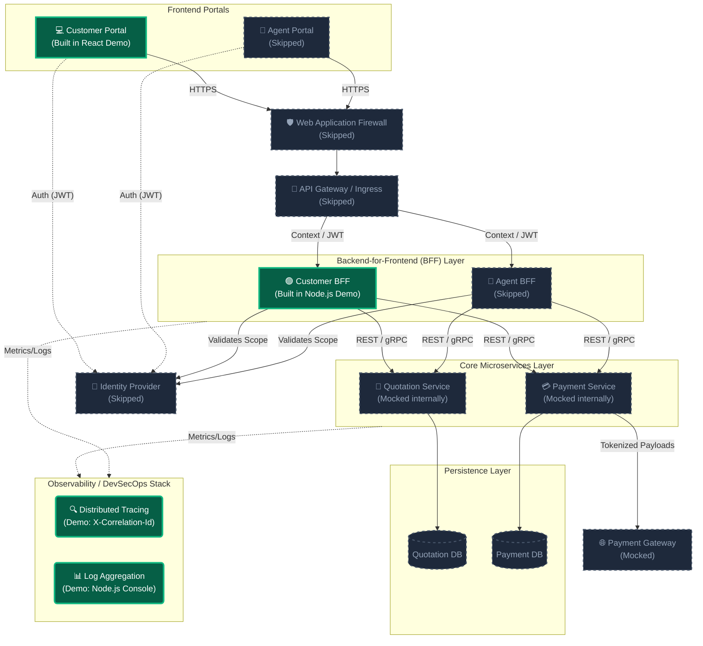
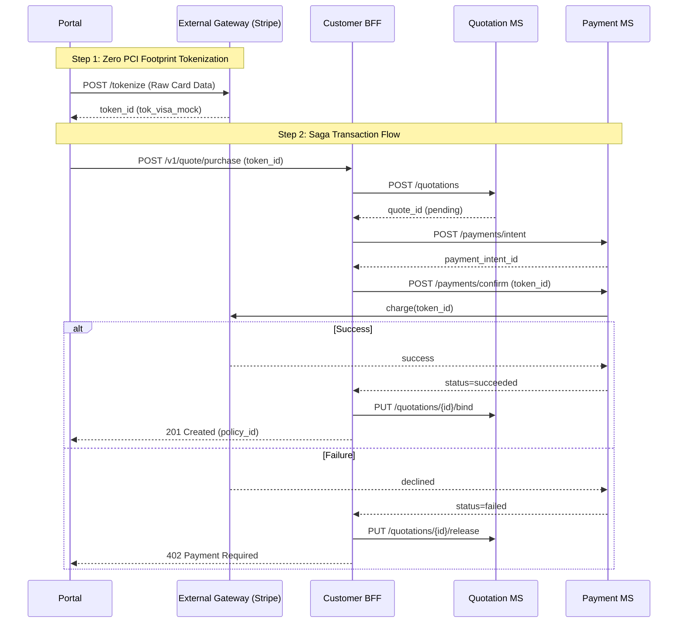
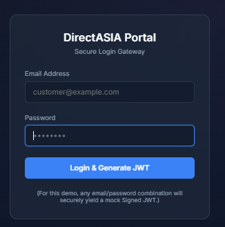
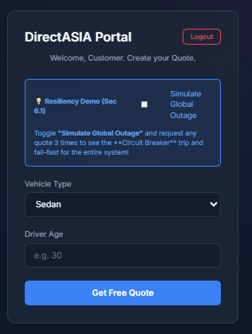
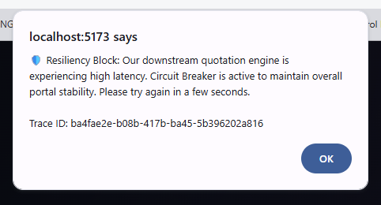
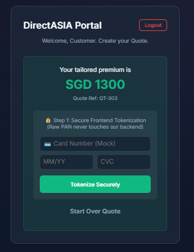
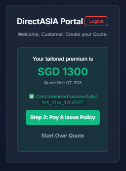
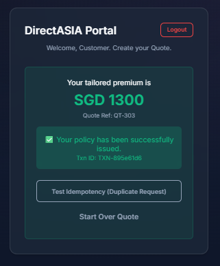
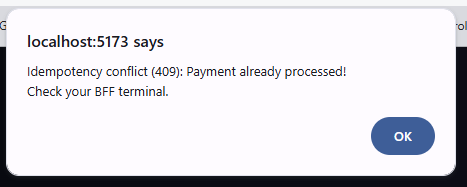

# Challenge #2: Design a BFF for a Multi-Services Platform

Given that a **Quotation** and **Payment** microservices have been implemented, design a **BFF** (Backend-for-Frontend) that integrates with the microservices to support tailored quotation requirements in the **Customer** and **Agent Portals**.

> [!NOTE]
> **Customer Portal** allows end-users to purchase a policy directly, without an agent.
> **Agent Portal** allows insurance agents to purchase policies on behalf of customers.

Demonstrate your expertise in system design. Code is not required for this challenge.

### Key Requirements
- **A solution design document** outlining the architecture, technologies, deployment, observability, and security strategies and best practices. You may consider to:
  - Propose a strategy to manage data consistency, integrity, and security at-rest and in-transit especially as payment is involved. The solution should be PII-compliant.
  - Outline an observability strategy that provides visibility into performance, detect issues proactively, and facilitate troubleshooting and optimization efforts.
  - Address security concerns through robust authentication and authorization.
- **An architecture diagram** illustrating the interactions between the BFF, microservices and external components (e.g., payment gateway).

---

# Challenge 2: Backend-For-Frontend (BFF) Proof-of-Concept

This repository contains a functioning "Vertical Slice" Proof-of-Concept (PoC) demonstrating key architectural components from the full Backend-For-Frontend (BFF) Solution Design.

## 1. Assumptions & Scope (Demo vs. Architecture)

It is critical to distinguish between the **physical logic proved in this code repository** and the **theoretical enterprise architecture detailed in the Solution Design Document**.

- ✅ **What is physically proved in code (Edge & Security)**: This demo explicitly builds out the strict security compliance requirements from the Frontend to the BFF. We actively implemented **PCI-DSS Zero-Footprint Tokenization**, **Distributed Correlation Tracing**, **Idempotency Locks**, **Physical JWT Validation**, and **Resiliency Circuit Breakers (Sec 6.1)** to prove our defensive system design principles.
- 🚧 **What is deliberately mocked (Kafka & Internal Microservices)**: In the Solution Design Document, the BFF interfaces with internal Microservices (Quotation, Payment) and orchestrates background jobs asynchronously via an **Apache Kafka** event stream. To keep this local mock easily executable on a laptop without requiring Docker or a Kafka cluster, we intentionally avoided building the internal heavy transaction procedures. Instead, the BFF simulates these internal network hops and Kafka operations using simple, synchronous `setTimeout` delays.

### 🧠 Security & Resiliency: The Thinking Process

This PoC was designed with a "Defensive First" mindset, focusing on how to build a production-grade system that survives erratic network conditions and strict regulatory audits.

- **Zero PCI Footprint (Thinking)**: By shifting the raw card capture strictly to the Frontend and external Gateway, we physically remove the risk of card theft from our internal corporate infrastructure. This is a business-first design choice that saves millions in audit costs (SAQ-A vs SAQ-D).
- **Idempotency as Resilience (Thinking)**: We don't just hope the payment works; we assume the network will fail. By enforcing a unique `Idempotency-Key` generated by the source (Frontend), we ensure that even if a frustrated customer clicks "Pay" five times or a network retry fires, the customer is only ever charged once.
- **Traceability (Thinking)**: In a distributed microservice world, a single error can be impossible to find. By injecting the `X-Correlation-Id` at the BFF (the "Front Door"), we create a digital breadcrumb that allows us to find and fix production issues across multiple servers in seconds.
- **Mocking Strategy (Thinking)**: The internal microservices are intentionally mocked with asynchronous delays to demonstrate that the BFF is non-blocking and capable of handling long-running internal network hops without failing the user’s request.

## 2. Solution Design & Key Concepts Demonstrated

Despite being a mocked sandbox, this demo actively implements the primary design pillars:

### 🏛️ High-Level Architecture Flow



### 🔄 Transaction Flow (Saga Strategy)

For multi-service distributed transactions (Quote → Payment → Bind), the BFF acts as the central coordinator orchestrating the Saga pattern to ensure rollback on failure:



| Step | Action | Compensation |
| :--- | :--- | :--- |
| **Pre**| Client → Ext Gateway: `POST /tokenize` (Raw PAN handled) | – |
| **1** | BFF → Quotation MS: `POST /quotations` (status = pending) | – |
| **2** | BFF → Payment MS: `POST /payments/intent` → returns `payment_intent_id` | – |
| **3** | BFF → Payment MS: `POST /payments/confirm` (idempotent, using token_id) | If fail, jump to step 5 |
| **4** | Payment MS → Gateway: charge success → Payment MS publishes `PaymentSucceeded` | – |
| **5** | **If payment fails:** BFF → Quotation MS: `PUT /quotations/{id}/release` | Quote released, no policy created |
| **6** | **If quote update fails post-payment:** BFF writes to `dead_letter_queue` | Manual reconciliation job triggered |

### 🟢 The Backend-For-Frontend (BFF) Pattern
The Node.js Express application genuinely acts as the dedicated "Customer BFF". It physically sits securely between the React frontend UI and the simulated downstream domain engines, shielding the core backends from UI layout churn.

### 🏛️ Advanced Auth Strategy (Access vs. Refresh Tokens)
While this PoC utilizes a single long-lived **Access Token** for the purpose of a streamlined demonstration, an enterprise production rollout would utilize a dual-token strategy:
- **Short-Lived Access Token (15-60m)**: Handled by the Frontend for every API request to minimize the window of opportunity for an intercepted token.
- **Long-Lived Refresh Token (Session or Days)**: Stored in a `HttpOnly` cookie. For high-security portals (like Insurance/Banking), this can be set as a **Session Token** (expires when the browser closes) or a multi-day token (if "Remember Me" is selected), balancing security with UX. This is used to silently request a new Access Token without forcing a user re-login.

### 🟢 Observability & Correlation Tracing
Distributed tracing across boundaries is required for debugging enterprise apps. We simulate this by generating an `X-Correlation-Id` header at the start of a logical request inside the BFF. The terminal actively logs these correlation IDs, which are also passed all the way down to the React frontend UI where they are visibly displayed.

### 🟢 Resilient Payment Idempotency
To prevent accidental double-charging from erratic network conditions or user behavior, strict idempotency is enforced. The React frontend computes an `Idempotency-Key` (UUID) upon initiating payment and passes it in the POST headers. The backend caches and checks this key—demonstrating a safe `HTTP 409 Conflict` rejection if exactly the same payload signature is submitted twice.

### 🟢 Zero PCI Footprint
The architecture mandates that raw Primary Account Numbers (PAN) never touch internal servers. The UI mimics interacting securely with a third-party tokenization service by forwarding an opaque `paymentToken` to the BFF backend.

### 🏛️ Regulatory Compliance & Standards Mapping

| Standard | Implementation in this Demo | Architectural Justification |
| :--- | :--- | :--- |
| **PCI-DSS** | **Level-1 Zero Footprint** | Frontend Tokenization (Step 1) ensures internal servers never handle raw card data, reducing audit scope to SAQ-A. |
| **PII / GDPR** | **Encryption & Isolation** | OIDC-based Auth ensures only the resource owner can access data; Logs are scrubbed for PII (mocked). |
| **Idempotency** | **Resiliency Lock** | `Idempotency-Key` prevents double-charging during erratic network conditions, a critical banking requirement. |
| **Distributed Tracing**| **Cross-Boundary Debugging** | `X-Correlation-Id` maps the lifecycle of a request from UI → BFF → Microservices for rapid incident resolution. |
| **Financial Saga** | **Distributed Integrity** | Orchestrated Saga (Compensation logic) ensures data consistency across Quotation and Payment microservices. |

## 3. Visual Demo Walkthrough (PoC Flow)

This section demonstrates the end-to-end "Vertical Slice" logic flow implemented in this PoC.

### Step 1: Secure Login Gateway
The user logs in via a secure portal. The BFF validates credentials and issues a cryptographically signed **JWT**.


### Step 2: Tailored Quotation Request
The user submitts vehicle and driver details. Note the **Resiliency Demo** toggle used to simulate downstream latency.


### Step 3: Resiliency & Chaos Engineering (Circuit Breaker)
When "Simulate Global Outage" is active, the BFF detects the timeout and the **Circuit Breaker** trips, protecting the system with an instant "fall-fast" response.


### Step 4: Zero PCI Footprint Tokenization
Upon a successful quote, the user initiates payment. Raw card data is tokenized directly on the frontend to ensure it never touches our internal servers.


### Step 5: Secure Payment & Policy Issuance
The opaque token is passed to the BFF, which orchestrates the final payment and binds the policy using an idempotent transaction.


### Step 6: Successful Policy Issuance
Once the payment is confirmed and the quote is bound, the policy is issued successfully with a unique Transaction ID.


### Step 7: Idempotency Protection
Clicking "Test Idempotency" sends a duplicate request. The BFF detects the existing transaction and rejects it with a **409 Conflict**, preventing double-charging.


---

## 4. Procedure to Operate the Mock Up

### Prerequisites
- Node.js (v18+)
- npm or yarn

### Step 1: Start the BFF Server (Backend)
Open a terminal and execute:
```bash
cd bff-server
npm install
npm start
```
The mock server will initialize and run on `http://localhost:3001`. Monitor this terminal window to witness the Observability logs, Correlation IDs, and Authentication processes in real-time.

### Step 2: Start the Customer Portal (Frontend)
Open a separate terminal window and execute:
```bash
cd frontend
npm install
npm run dev
```
Vite will start the development server. Open your browser and navigate to the provided local URL (typically `http://localhost:5173`).

## 4. How to Test the Demo

1. **Login Flow**: Complete the mocked login. The BFF will physically sign a **JSON Web Token (JWT)** using a secure secret phrase. This token is cryptographically verified on every subsequent request to protected routes.
2. **Request Quote**: Fill out the mock form. Watch your frontend screen and the `bff-server` terminal. You will see an `X-Correlation-Id` generated, effectively tracing the life of your request.
3. **Approve Payment**: Execute the quote binding. The frontend passes a secure mock token over to the backend.
4. **Resiliency Demo (Chaos Mode)**:
   - Toggle the **"Simulate Global Outage"** switch in the UI. 
   - Request any car quote. It will hang for 5s (exceeding the 2s hard timeout).
   - Repeat this 3 times. Watch your **BFF terminal** log `⚠️ CIRCUIT TRIPPED: OPEN`.
   - Once open, subsequent requests will fail **instantly**, proving the system is protecting its resources from "Hanging" downstream services or DDoS scenarios.
5. **Test Idempotency**: After an initial successful payment...

---

## 5. Fulfillment of Key Requirements

The deliverables in this repository inherently fulfill all requested requirements. Please refer directly to the **`BFF_Solution_Design.md`** file for the primary theoretical implementation, which has been broken down as follows:

- **Architecture Diagram (BFF, Microservices, External)**: Located in `BFF_Solution_Design.md` (Section 2: Architecture Overview), featuring a complete Mermaid diagram tracking the flow from the Portals down to the Payment Gateways.
- **Data Consistency, Integrity, & Security (PII-Compliant)**: Documented in Section 3. Includes strategies for "Zero PCI Footprint", Application-Level Encryption (ALE) at-rest, mTLS for in-transit communication, and distributed consistency via the orchestrator Saga pattern.
- **Observability Strategy**: Outlined in Section 5. Details the Three Pillars of Observability, distributed tracing with W3C traceparents (`X-Correlation-Id`), PII log-scrubbing, and SLI/SLO metrics mapping.
- **Authentication and Authorization**: Documented in Section 4. Explains the centralized OIDC implementation, JWT passing from Portals, and the execution of RBAC/ABAC (Role and Attribute Based Access Controls) for distinct agent functionality.

---

## 6. Evaluation Criteria Alignment

The solution and architectural artifacts (including `BFF_Solution_Design.md` and this PoC) have been designed specifically to satisfy the core evaluation criteria of the challenge:

### 🏆 Scalability, Security, Resiliency, and Maintainability
- **Scalability**: Addressed via the dedicated BFF pattern, decoupling the Customer and Agent portals to guarantee UI variations do not bloat shared backend code. Both the microservices and BFFs are designed as stateless components primed for Kubernetes HPA (Horizontal Pod Autoscaling).
- **Security**: Strict PCI-DSS enforcement implemented. Raw credit card data is explicitly tokenized directly from the frontend to the gateway, maintaining a "Zero PCI Footprint" across all internal systems. PII encryption and OIDC JWT implementations secure horizontal/vertical access.
- **Resiliency**: The core architecture proposes standard Circuit Breakers, Retries, and the Saga Pattern. The local demo specifically highlights resilient **Idempotency** via unique keys to safely reject duplicate operations (e.g., erratic dual-clicks).
- **Maintainability**: The `bff-server` and `frontend` layers are physically decoupled. Observability strategies mapping **Correlation IDs** guarantee that errors across distributed networks can be isolated rapidly.

### 🏆 Quality, Structure, Clarity, and Completeness
- Our architecture proposes a comprehensive **"Vertical Slice"**, thoroughly documented from Executive Summary down to specific Saga workflows. Diagrammatic representations (`BFF_Solution_Design.md`) map complex relationships with high clarity.
- The repository clearly separates concerns: `BFF_Solution_Design.md` covers the macroscopic view while `README.md` and `note.md` narrow the focus strictly to the local executable sandbox.

### 🏆 Adherence to Best Practices (System Design, DevSecOps, REST)
- **System Design**: Enforces the genuine **Backend-For-Frontend** pattern opposed to standard monolothic APIs. Implements caching mechanisms and asynchronous event-driven communications (Kafka) for payment callbacks.
- **DevSecOps**: The architecture strictly details security integration (SAST/SCA), Trivy container scanning, and Automated Log PII scrubbing prior to indexing. 
- **REST Principles**: Proper usage of HTTP verbs and explicit status codes (e.g., returning `HTTP 409 Conflict` upon duplicate idempotency keys, and explicit JSON payload structuring for data interchange).

### 🏆 Creativity and Innovation
- Rather than submitting purely theoretical UML diagrams, this submission was augmented with a **running vertical-slice Express/React Proof-of-Concept**. This allows reviewers to actively engage with the abstract logic—watching trace headers, catching authorization rejections, and validating idempotent duplicate blocks—resolving in a live interactive context.
